# 東南旅遊機票資料爬蟲系統 - 類別圖

## 類別圖概述

本文件描述東南旅遊機票資料爬蟲系統的類別設計。類別圖展示了系統中各個類別的結構、職責以及它們之間的關係，為系統實現提供了藍圖。

## Mermaid 類別圖代碼

```mermaid
classDiagram
    %% 主要控制類
    class CrawlerController {
        -TaskManager taskManager
        -ConfigManager configManager
        -LogManager logManager
        +initialize()
        +start_crawling(task_id)
        +batch_crawling(task_list)
        +handle_error(exception)
        -_execute_crawling_task(task_id)
        -_build_query_payload(task_data, searchLeg, searchId)
        -_schedule_retry_task(task_id)
    }
    
    class TaskManager {
        -Queue task_queue
        -int maxConcurrentTasks
        -Dict~String, Object~ active_tasks
        -Dict~String, Object~ tasks_data
        -Semaphore task_slots
        -Lock lock
        -Function crawler_callback
        +__init__(max_concurrent_tasks)
        +set_crawler_callback(callback_function)
        +add_task(params)
        +process_batch_tasks()
        +get_task_status(task_id)
        +get_next_task()
        +handle_task_failure(task_id, error)
        +release_task_slot()
        +is_queue_empty()
        -_task_worker()
    }
    
    %% API客戶端類
    class ApiClient {
        -Session session
        -ConfigManager configManager
        -LogManager logManager
        -Dict headers
        +__init__(config_manager, log_manager)
        +initialize_session()
        +send_graphql_request(payload)
        +handle_response(response)
        +handle_errors(exception)
        +close_session()
    }
    
    %% 數據處理類
    class JsonParser {
        -LogManager log_manager
        -ConfigManager config_manager
        -Object api_response
        -List structured_data
        +__init__(log_manager, config_manager)
        +parse_api_response(json_data) -> bool
        +parse_inbound_response(json_data, outbound_flight_info) -> List[FlightInfo]
        +extract_outbound_flight_data(flight_item) -> Optional[FlightInfo]
        +get_structured_data() -> List[FlightInfo]
        -_extract_flight_info(flight_data) -> Dict[str, Any]
        -_extract_fare_info(fare_item) -> Dict[str, Any]
        -_extract_segment_data(segment_data) -> List[FlightSegment]
        -_extract_price_data(fare_info) -> Dict[str, float]
        -_parse_date(date_str) -> Optional[datetime.date]
    }
    
    class DataProcessor {
        -LogManager log_manager
        -StorageManager storage_manager
        -List raw_data
        -List processed_data
        -String json_data
        -DataFrame table_data
        +__init__(storage_manager, log_manager)
        +process_data(raw_data) -> List[FlightInfo]
        +save_to_storage(filename) -> bool
        +convert_to_json() -> str
        +convert_to_table() -> DataFrame
        +validate_data(data) -> bool
    }
    
    %% 存儲管理類
    class StorageManager {
        -CloudStorageClient storage_client
        -BigQueryClient bq_client
        -LogManager log_manager
        -ConfigManager config_manager
        -Dict storage_config
        +__init__(config_manager, log_manager)
        -_check_gcp_env() -> bool
        -_get_storage_config() -> Dict[str, Any]
        +save_to_cloud_storage(json_data, filename) -> bool
        -_save_to_local(json_data, filename) -> bool
        +save_binary_to_cloud_storage(binary_data, filename, content_type) -> bool
        +save_to_bigquery(table_data) -> bool
        +get_storage_config() -> Dict[str, Any]
    }
    
    %% 配置與日誌類
    class ConfigManager {
        -Dict config
        -String config_file
        +__init__()
        +load_config(config_file)
        +get_api_config()
        +get_retry_config()
        +get_storage_config()
        +get_log_config()
        +get_website_config()
    }
    
    class LogManager {
        <<singleton>>
        -Logger logger
        -static LogManager _instance
        +__new__(cls, *args, **kwargs)
        +__init__(config_manager)
        +log_info(message)
        +log_error(message, exception)
        +log_task_status(task_id, status)
        +log_debug(message)
        +log_warning(message)
    }
    
    %% 數據模型類
    class FlightInfo {
        <<dataclass>>
        +Optional~Date~ departure_date = None
        +Optional~Date~ return_date = None
        +Float price = 0.0
        +Float tax = 0.0
        +List~FlightSegment~ outbound_segments = field(default_factory=list)
        +List~FlightSegment~ inbound_segments = field(default_factory=list)
        +Optional~str~ search_id = None
        +to_json() -> str
        +to_dict() -> Dict[str, Any]
    }
    
    class FlightSegment {
        <<dataclass>>
        +Optional~str~ flight_number = None
        +Optional~str~ cabin_class = None
        +to_json() -> str
        +to_dict() -> Dict[str, Any]
    }
    
    class CrawlTask {
        +String task_id
        +Dict parameters
        +String status
        +DateTime start_time
        +DateTime end_time
        +List~FlightInfo~ result
        +Dict error_info
        +__init__(task_id, parameters, status, start_time, end_time, result)
        +to_dict() -> Dict[str, Any]
    }
    
    %% 類別之間的關係
    CrawlerController --> TaskManager : 使用
    CrawlerController --> ConfigManager : 使用
    CrawlerController --> LogManager : 使用
    
    TaskManager --> ApiClient : 創建和管理
    TaskManager --> CrawlTask : 管理
    
    ApiClient --> JsonParser : 提供API響應
    
    JsonParser --> DataProcessor : 傳遞解析數據
    
    DataProcessor --> StorageManager : 使用
    DataProcessor --> FlightInfo : 創建和管理
    
    StorageManager --> ConfigManager : 使用
    StorageManager --> LogManager : 使用
    
    CrawlTask --> FlightInfo : 包含
    FlightInfo --> FlightSegment : 包含
```

## 類別職責詳細說明

### 1. 控制與管理類

#### `CrawlerController`（爬蟲控制器）
- **職責**：作為系統的主要入口點，協調整個爬蟲流程，管理任務執行
- **主要方法**：
  - `initialize()`: 初始化爬蟲參數
  - `start_crawling(task_id)`: 開始單個爬蟲任務
  - `batch_crawling(task_list)`: 批次執行多個爬蟲任務
  - `handle_error(exception)`: 處理錯誤情況
  - `_execute_crawling_task(task_id)`: 執行單個爬蟲任務，作為任務管理器的回調函數
  - `_build_query_payload(task_data, searchLeg, searchId)`: 根據任務數據構建GraphQL查詢參數
  - `_schedule_retry_task(task_id)`: 安排任務重試
- **關聯**：
  - 使用 `TaskManager` 管理爬蟲任務
  - 使用 `ConfigManager` 獲取配置信息
  - 使用 `LogManager` 記錄系統日誌

#### `TaskManager`（任務管理器）
- **職責**：管理爬蟲任務隊列，控制並行任務數量，確保系統資源合理利用
- **主要屬性**：
  - `task_queue`: 任務隊列，存儲待執行的任務
  - `maxConcurrentTasks`: 最大並行任務數，設定為4
  - `active_tasks`: 當前活動的任務字典，鍵為任務ID，值為任務參數
  - `tasks_data`: 所有任務數據字典，包括已完成的任務
  - `task_slots`: 信號量，用於控制並行任務數
  - `lock`: 線程鎖，用於同步訪問共享資源
  - `crawler_callback`: 爬蟲控制器回調函數
- **主要方法**：
  - `__init__(max_concurrent_tasks)`: 初始化任務管理器，設置最大並行任務數
  - `set_crawler_callback(callback_function)`: 設置爬蟲控制器回調函數
  - `add_task(params)`: 添加新任務到隊列
  - `process_batch_tasks()`: 處理批量任務
  - `get_task_status(task_id)`: 獲取任務狀態
  - `get_next_task()`: 獲取隊列中的下一個任務
  - `handle_task_failure(task_id, error)`: 處理任務失敗
  - `release_task_slot()`: 釋放任務槽位，允許執行下一個任務
  - `is_queue_empty()`: 檢查隊列是否為空
  - `_task_worker()`: 任務工作線程函數
- **關聯**：
  - 創建和管理 `ApiClient` 實例
  - 管理 `CrawlTask` 對象

### 2. API客戶端與除錯類

#### `ApiClient`（API客戶端）
- **職責**：負責發送GraphQL API請求並處理響應
- **主要屬性**：
  - `session`: Requests庫的Session實例，用於發送HTTP請求
  - `configManager`: 配置管理器引用
  - `logManager`: 日誌管理器引用
  - `headers`: 請求標頭字典
- **主要方法**：
  - `__init__(config_manager, log_manager)`: 初始化API客戶端，設置配置管理器、日誌管理器和除錯工具
  - `initialize_session()`: 初始化HTTP會話，設置請求標頭和超時
  - `send_graphql_request(payload)`: 發送GraphQL請求到API端點
  - `handle_response(response)`: 處理API響應，檢查狀態碼和返回數據
  - `handle_errors(exception)`: 處理請求過程中的錯誤和異常
  - `close_session()`: 關閉HTTP會話，釋放資源
- **關聯**：
  - 向 `JsonParser` 提供API響應數據

### 3. 數據處理類

#### `JsonParser`（JSON解析器）
- **職責**：解析GraphQL API響應，提取機票資料
- **主要屬性**：
  - `log_manager`: 日誌管理器實例，用於記錄解析過程中的信息
  - `config_manager`: 配置管理器實例，用於獲取解析配置
  - `api_response`: API返回的原始JSON數據
  - `structured_data`: 結構化後的數據列表
- **主要方法**：
  - `__init__(log_manager, config_manager)`: 初始化JSON解析器
  - `parse_api_response(json_data) -> bool`: 解析API返回的JSON數據(主要用於去程)
  - `parse_inbound_response(json_data, outbound_flight_info) -> List[FlightInfo]`: 解析回程API響應並與去程關聯
  - `extract_outbound_flight_data(flight_item) -> Optional[FlightInfo]`: 從航班項目數據中提取去程航班信息
  - `get_structured_data() -> List[FlightInfo]`: 獲取結構化的數據
  - `_extract_flight_info(flight_data) -> Dict[str, Any]`: 提取航班基本信息
  - `_extract_fare_info(fare_item) -> Dict[str, Any]`: 提取票價信息
  - `_extract_segment_data(segment_data) -> List[FlightSegment]`: 提取航段數據
  - `_extract_price_data(fare_info) -> Dict[str, float]`: 提取價格和稅金數據
  - `_parse_date(date_str) -> Optional[datetime.date]`: 解析日期字符串
- **關聯**：
  - 向 `DataProcessor` 傳遞解析後的數據

#### `DataProcessor`（數據處理器）
- **職責**：處理和轉換爬取的數據，準備存儲
- **主要屬性**：
  - `log_manager`: 日誌管理器實例
  - `storage_manager`: 存儲管理器實例
  - `raw_data`: 原始數據
  - `processed_data`: 處理後的數據
  - `json_data`: JSON格式數據
  - `table_data`: 表格格式數據
- **主要方法**：
  - `__init__(storage_manager, log_manager)`: 初始化數據處理器
  - `process_data(raw_data) -> List[FlightInfo]`: 處理原始數據並返回處理後的數據
  - `save_to_storage(filename) -> bool`: 將數據保存到存儲系統
  - `convert_to_json() -> str`: 轉換為JSON格式
  - `convert_to_table() -> DataFrame`: 轉換為表格格式
  - `validate_data(data) -> bool`: 驗證數據完整性
- **關聯**：
  - 使用 `StorageManager` 存儲數據
  - 創建和管理 `FlightInfo` 對象

### 4. 存儲管理類

#### `StorageManager`（存儲管理器）
- **職責**：管理數據存儲操作，與Cloud Storage和BigQuery交互
- **主要屬性**：
  - `storage_client`: Cloud Storage客戶端
  - `bq_client`: BigQuery客戶端
  - `log_manager`: 日誌管理器實例
  - `config_manager`: 配置管理器實例
  - `storage_config`: 存儲配置字典
- **主要方法**：
  - `__init__(config_manager, log_manager)`: 初始化存儲管理器
  - `_check_gcp_env() -> bool`: 檢查是否在Google Cloud環境中運行
  - `_get_storage_config() -> Dict[str, Any]`: 獲取存儲配置
  - `save_to_cloud_storage(json_data, filename) -> bool`: 保存JSON數據到Cloud Storage
  - `_save_to_local(json_data, filename) -> bool`: 將數據保存到本地（備份方案）
  - `save_binary_to_cloud_storage(binary_data, filename, content_type) -> bool`: 保存二進制數據到Cloud Storage
  - `save_to_bigquery(table_data) -> bool`: 保存表格數據到BigQuery
  - `get_storage_config() -> Dict[str, Any]`: 獲取存儲配置
- **關聯**：
  - 使用 `ConfigManager` 獲取存儲配置
  - 使用 `LogManager` 記錄存儲操作

### 5. 配置與日誌類

#### `ConfigManager`（配置管理器）
- **職責**：管理系統配置，如API設置、重試策略、存儲配置、除錯設置等
- **主要屬性**：
  - `config`: 配置字典
  - `config_file`: 配置文件路徑
- **主要方法**：
  - `__init__()`: 初始化配置管理器
  - `load_config(config_file)`: 從文件加載配置
  - `get_api_config()`: 獲取API配置，包括端點URL和請求標頭
  - `get_retry_config()`: 獲取重試配置
  - `get_storage_config()`: 獲取存儲配置
  - `get_log_config()`: 獲取日誌配置
  - `get_website_config()`: 獲取網站配置

#### `LogManager`（日誌管理器）
- **職責**：管理系統日誌，記錄關鍵操作和錯誤
- **設計模式**：單例模式，確保系統中只有一個日誌管理實例
- **主要屬性**：
  - `logger`: 內部日誌記錄器
  - `_instance`: 類靜態變量，存儲唯一實例
- **主要方法**：
  - `__new__(cls, *args, **kwargs)`: 實現單例模式
  - `__init__(config_manager)`: 初始化日誌管理器，設置日誌級別和輸出文件
  - `log_info(message)`: 記錄信息
  - `log_error(message, exception)`: 記錄錯誤
  - `log_task_status(task_id, status)`: 記錄任務狀態
  - `log_debug(message)`: 記錄調試信息
  - `log_warning(message)`: 記錄警告信息
- **關聯**：
  - 被系統中的其他組件使用，提供日誌記錄功能

### 6. 數據模型類

#### `FlightInfo`（航班信息 - DataClass）
- **職責**：表示單個機票的信息，包含去程和回程的所有航段
- **主要屬性**：
  - `departure_date`: 出發日期 (Optional[date] = None)
  - `return_date`: 返回日期 (Optional[date] = None)
  - `price`: 票價 (float = 0.0)
  - `tax`: 稅金 (float = 0.0)
  - `outbound_segments`: 去程航段列表 (List[FlightSegment] = field(default_factory=list))
  - `inbound_segments`: 回程航段列表 (List[FlightSegment] = field(default_factory=list))
  - `search_id`: 搜尋ID，用於關聯去程和回程 (Optional[str] = None)
- **主要方法**：
  - `to_json() -> str`: 轉換為JSON格式，返回包含航班資訊的 JSON 字串
  - `to_dict() -> Dict[str, Any]`: 轉換為字典格式，返回包含航班資訊的字典

#### `FlightSegment`（航班段 - DataClass）
- **職責**：表示單個航班段的詳細信息
- **主要屬性**：
  - `flight_number`: 航班編號 (Optional[str] = None)
  - `cabin_class`: 艙等 (Optional[str] = None)
- **主要方法**：
  - `to_json() -> str`: 將航班段資訊轉換為 JSON 格式，返回包含航班段資訊的 JSON 字串
  - `to_dict() -> Dict[str, Any]`: 將航班段資訊轉換為字典格式，返回包含航班段資訊的字典

#### `CrawlTask`（爬蟲任務）
- **職責**：表示單個爬蟲任務
- **主要屬性**：
  - `task_id`: 任務ID
  - `parameters`: 爬蟲參數
  - `status`: 任務狀態
  - `start_time`: 開始時間
  - `end_time`: 結束時間
  - `result`: 任務結果
  - `error_info`: 錯誤信息
- **主要方法**：
  - `__init__(task_id, parameters, status, start_time, end_time, result)`: 初始化爬蟲任務實例
  - `to_dict() -> Dict[str, Any]`: 轉換為字典格式
